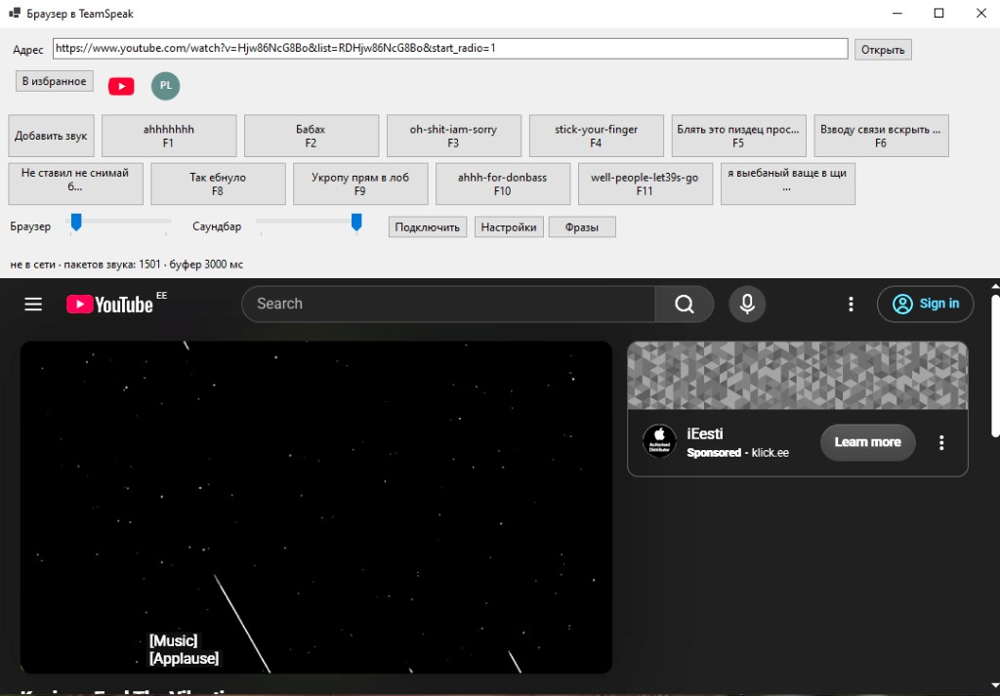

# TS3 audio browser

Окно с браузером, которое заходит на TeamSpeak 3 отдельным клиентом и передаёт в канал звук открытой страницы.



Канал сервера должен использовать кодек Opus Music. Личность и настройки сохраняются в `%AppData%\TsBrowser`.

## Сборка

Нужен .NET 8 SDK.

```bat
dotnet publish TsBrowser.csproj -c Release -r win-x64 --self-contained true -o publish
```

Запуск: `publish\TsBrowser.exe`.

На машине должен стоять Visual C++ Redistributable x64: его требует встроенный Chromium.

## Распознавание фраз

Браузер, саундбар и подключение к TeamSpeak работают без этого блока. Фразы — отдельная галочка в окне «Фразы». В репозитории нет папок `python` и `models`: там несколько гигабайт, GitHub такие файлы в репозиторий не принимает.

Рядом с `TsBrowser.exe` должны оказаться две папки.

### Папка python

Интерпретатор ищется в одном из двух мест:

- `python\python.exe`
- `python\Scripts\python.exe`

Нужен Python 3.12, 64-bit. Из папки `publish`:

```bat
py -3.12 -m venv python
python\Scripts\python.exe -m pip install torch torchaudio --index-url https://download.pytorch.org/whl/cu128
python\Scripts\python.exe -m pip install faster-whisper
```

- Python 3.12: https://www.python.org/downloads/
- PyTorch со сборкой CUDA 12.8, не обычный пакет с процессора: https://pytorch.org/get-started/locally/ и индекс https://download.pytorch.org/whl/cu128
- faster-whisper: https://pypi.org/project/faster-whisper/

Отдельный CUDA Toolkit ставить не нужно. Библиотеки видеокарты приходят вместе с этим PyTorch.

На компьютере нужна видеокарта NVIDIA и свежий драйвер с поддержкой CUDA 12: https://www.nvidia.com/Download/index.aspx

Файл `phrase_listen.py` копируется при сборке сам, скачивать его не нужно.

### Папка models

При первом включении фраз модель скачивается сама в `models` рядом с программой. Нужен интернет, это около 1,5 ГБ. Дальше сеть для модели не нужна.

Чтобы положить её заранее, скачайте файлы репозитория https://huggingface.co/mobiuslabsgmbh/faster-whisper-large-v3-turbo и поместите их в `models\large-v3-turbo` рядом с exe:

- `model.bin`
- `config.json`
- `preprocessor_config.json`
- `tokenizer.json`
- `vocabulary.json`

Пока галочка «Включить распознавание фраз» включена, модель занимает около 1,5 ГБ памяти видеокарты. Снятие галочки её выгружает.
